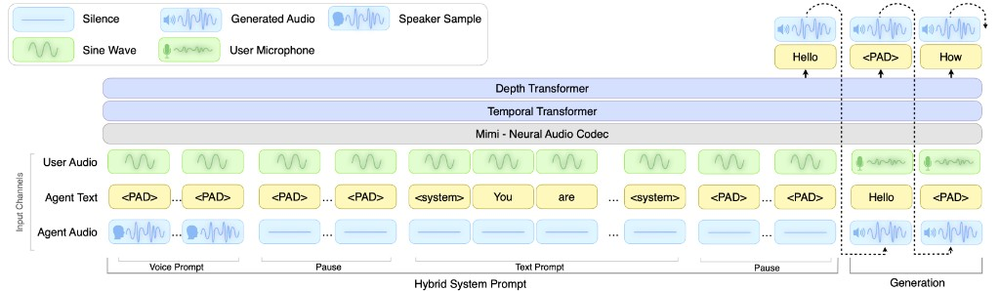

# KV Cache Prefill and Snapshot -- How It Works

**Type:** Conceptual explainer (derived from code analysis)
**Date:** March 12, 2026

---

## What is the KV cache?

The 7B transformer has a key-value (KV) cache -- its working memory. It is a ~1.5GB buffer in GPU VRAM (calculated as: 2 x 1 x 32 heads x 3,000 positions x 128 dim x 2 bytes x 32 layers = 1.46GB), allocated once at server startup and reused for every session. It holds 3,000 positions (4 minutes of audio at 12.5 Hz frame rate), with each position storing attention keys and values across all 32 transformer layers.

Think of it as a whiteboard bolted to the wall. You write on it, erase it, write again -- but the whiteboard itself is always there.

## Architecture overview



The diagram above shows the full picture. Left of the dotted line is **prefill** (the Hybrid System Prompt) -- the 7.6s cold start. Right of the dotted line is **generation** -- where the model actually speaks. The three input channels (User Audio, Agent Text, Agent Audio) are processed through Mimi (audio codec), the Temporal Transformer (7B main model), and the Depth Transformer (depformer) at each step.

---

## Prefill?

Before the model can have a conversation, the KV cache must be filled with context -- who the model is, how it should sound, and what it should talk about.

Prefill runs 135 sequential forward passes through the 7B transformer:

```
Step 1-51:     Voice prompt (NATF0.pt audio, 51 frames)
Step 52-57:    Silence padding (6 frames)
Step 58-129:   Text prompt (briefing text, 72 tokens)
Step 130-135:  Silence padding (6 frames)
```

Each step reads all prior KV cache entries and writes a new one. Steps cannot be parallelized -- step 100 must see steps 0-99. At ~56ms per step on the A10G (measured), this takes **7.6 seconds**.

After prefill, the model now "knows" it should sound like NATF0 and talk about the briefing in the text prompt.

## Snapshot?

A snapshot is a copy of the filled KV cache stored in a separate buffer (GPU VRAM, CPU RAM, or disk).

```
GPU VRAM layout after snapshot (estimated):

+--------------------------------------------------+
|  Model weights (7B, bf16)             ~18.7 GB   |
|  KV cache (live whiteboard)            ~1.5 GB   |
|  Snapshot (photocopy of whiteboard)    ~1.5 GB   |
|  PyTorch overhead                      ~0.5 GB   |
|  FREE                                  ~1.8 GB   |
+--------------------------------------------------+
Total: 24 GB (A10G)
```

The snapshot captures the KV cache state after all 135 prefill steps. It includes the attention keys/values for every layer, plus offset counters and token caches.

## The full pre-warm flow

### Without pre-warm (current, 7.6s cold start)

```
Adam taps notification
       |
       v
WebSocket connects
       |
       v
Zero the KV cache                          ~4ms
       |
       v
Prefill: 135 forward passes through 7B    7,600ms   <-- Adam is waiting
       |
       v
Handshake sent
       |
       v
Fetch starts speaking                      7.6 seconds after tap
```

### With pre-warm (estimated <200ms cold start)

```
Fetch assembles briefing
       |
       v
POST /api/prepare (voice_prompt, text_prompt)
       |                          |
       v                          v
Returns session_id          Background on GPU:
       |                     +- Zero KV cache
       v                     +- Prefill: 135 steps (7.6s)
Push notification            +- Save KV cache state to snapshot
sent to Adam                 +- Mark session READY
       |
       v
Adam taps (seconds to minutes later)
       |
       v
WebSocket connects with session_id
       |
       v
Zero the KV cache                          ~4ms
       |
       v
Copy snapshot -> KV cache                  ~50-200ms (estimate, depends on storage tier)
       |
       v
Handshake sent
       |
       v
Fetch starts speaking                      estimated ~200ms after tap
```

The 7.6 seconds of prefill happens **before Adam even receives the notification**. By the time he taps, the snapshot is ready. Restoring it is a memory copy -- no neural network computation, just copying ~1.5GB of tensors from the snapshot buffer into the active KV cache.

## Restore is fast

**Prefill is slow because each step runs the full 7B transformer:**
- Embed input tokens
- 32 layers of multi-head attention + feed-forward
- Depformer (8 codebook autoregressive steps)
- ~56ms per step, 135 steps

Restore skips all of that. It simply copies the pre-computed KV cache state and sets the offset:
```
copy_(kv_cache, snapshot, ~1.5GB)    // GPU-to-GPU or CPU-to-GPU
set offset = 135                      // one integer
```

The KV cache now looks identical to how it would look after 7.6 seconds of prefill.

## CUDA graphs

CUDA graphs are created once during server startup (`warmup()` runs 4 dummy steps). They persist across all sessions because `reset_streaming()` only resets the KV cache data (`offset` and `provided`), not the `CUDAGraphed` objects. After snapshot restore, the next `lm_gen.step()` call uses the existing CUDA graph at full speed (~56ms) with no re-warm penalty.

## Limitations

- **Memory cost:** Each snapshot uses ~1.5GB. On the A10G (24GB), only 1-2 snapshots fit in GPU VRAM alongside the model. For more headroom, snapshots can be stored in CPU RAM (estimated [to be tested] ~150-200ms to restore) or on disk (estimated ~500-1000ms from NVMe).

- **Config-specific:** Each unique (voice_prompt, text_prompt) combination needs its own snapshot. You cannot reuse a snapshot across different briefings -- the text prompt tokens are baked into the KV cache.

## Key numbers

| Metric | Value | Source |
|--------|-------|--------|
| Prefill time (current cold start) | 7,621ms | Measured (doc 01) |
| Snapshot size | ~1.5 GB | Calculated from model config |
| Restore time (GPU VRAM copy) | ~50ms | Estimate |
| Restore time (CPU RAM to GPU) | ~150-200ms | Estimate |
| Restore time (NVMe to GPU) | ~500-1000ms | Estimate |
| **Estimated cold start with pre-warm** | **~200ms** | **Estimate (CPU RAM path)** |
