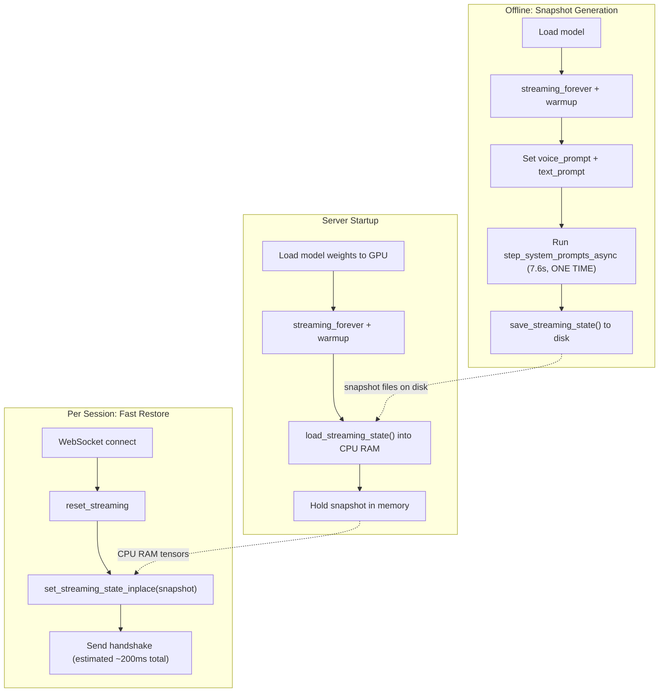

# KV Cache Snapshot/Restore to Eliminate Cold Start

**Type:** Implementation plan
**Date:** March 12, 2026
**Related:** [01_session-cold-start-timing-report.md](01_session-cold-start-timing-report.md) | [02_kv-cache-prefill-and-snapshot-explainer.md](02_kv-cache-prefill-and-snapshot-explainer.md)

---

## Why This Works

The 7.6s cold start is entirely sequential LM forward passes filling the KV cache (135 steps at ~56ms each -- measured in [doc 01](01_session-cold-start-timing-report.md)). Non-prefill overhead is <5ms (0.07%). If we pre-compute this once and save the resulting KV cache state, we can restore it via `tensor.copy_()` instead of re-running all 135 steps.

The codebase already has the infrastructure for this:
- `streaming.py` lines 367-391: `save_streaming_state()` -- serializes all KV cache tensors + metadata to safetensors + JSON
- `streaming.py` lines 232-259: `load_streaming_state()` -- loads from disk
- `streaming.py` lines 393-403: `set_streaming_state_inplace()` -- copies loaded tensors into live streaming state via `tensor.copy_()`

---

## Snapshot Size (Calculated)

Main LM transformer KV cache (the bulk):
- Per attention layer: `(2, 1, 32, 3000, 128)` bfloat16 = ~49 MB (2 x 1 x 32 x 3000 x 128 x 2 bytes)
- 32 layers = **~1.5 GB** total
- Plus small tensors (cache, provided, offsets) = negligible

---

## Estimated Restore Speed by Storage Tier

All restore times are **projections** -- not yet benchmarked.

| Strategy | Estimated Cold Start | Estimated Savings vs 7.6s | VRAM Cost |
|----------|---------------------|--------------------------|-----------|
| **GPU VRAM cache** (tensor.copy_) | ~50ms | 99.3% | +1.5 GB per cached config |
| **CPU RAM cache** (pinned mem to GPU) | ~150-200ms | 97% | 0 VRAM, +1.5 GB RAM |
| **NVMe SSD** (disk to GPU) | ~500-1000ms | 87-93% | 0 |
| **EBS gp3** (network disk to GPU) | ~1500-3000ms | 60-80% | 0 |

The CPU RAM restore estimate of 150-200ms is conservative. At PCIe 4.0 theoretical bandwidth (~32 GB/s), the physical transfer of 1.5 GB takes ~47ms. The 150-200ms range accounts for Python/CUDA synchronization overhead.

**Recommendation:** CPU RAM cache for the best balance -- no extra VRAM consumed, and 150-200ms is well within the target.

---

## Architecture



---

## What State Is Captured

The snapshot captures the **full LMGen streaming state tree** after prefill (verified from `_flatten_streaming_state()` in `streaming.py` and `_LMGenState` in `lm.py`):

- `_LMGenState.cache` -- token history `[1, 17, max_delay+3]` (long)
- `_LMGenState.provided` -- teacher-forcing mask (bool)
- `_LMGenState.offset` -- step counter (= 135 after prefill)
- `lm_model.transformer.layers.{0..31}.self_attn.kv_cache.cache` -- the actual KV tensors `[2, 1, 32, 3000, 128]` (bfloat16)
- `lm_model.transformer.layers.{0..31}.self_attn.kv_cache.end_offset` -- position counters `[1]` (long)
- `lm_model.transformer.layers.{0..31}.self_attn.offset` -- attention offset `[1]` (long)
- `lm_model.transformer.layers.{0..31}.self_attn.offset_cpu` -- CPU-side offset (int, stored as metadata)
- `lm_model.transformer.offset` -- transformer-level offset `[1]` (long)

What is NOT captured (and does not need to be):
- CUDAGraphed objects (`CUDAGraphed.asdict()` returns `{}`) -- they persist across sessions from `warmup()`
- Mimi state -- `mimi.reset_streaming()` is called after prefill anyway
- `text_prompt_tokens`, `voice_prompt` -- instance attributes on LMGen, set separately before prefill
- Depformer state -- `depformer.set_streaming_propagate(False)` excludes it; depformer resets per step inside `depformer_step()`

---

## Implementation Steps

### Step 1: Snapshot generation script

Create a script (e.g. `generate_snapshot.py`) that:
1. Loads the model (same as `ServerState.__init__()`)
2. Calls `streaming_forever(1)` + `warmup()`
3. Sets voice prompt + text prompt
4. Runs `step_system_prompts_async()` (the 7.6s prefill)
5. Calls `lm_gen.save_streaming_state("snapshot.safetensors", "snapshot_metadata.json")`
6. Also saves the voice_prompt path and text_prompt hash as metadata so we know what config this snapshot is for

### Step 2: Server startup -- pre-load snapshot to CPU RAM

In `ServerState.__init__()` in `server.py`:
1. After model load + `streaming_forever()` + `warmup()`
2. Call `load_streaming_state(snapshot_path, metadata_path, device='cpu')`
3. Pin the CPU tensors for faster GPU transfer: `tensor.pin_memory()`
4. Store as `self._cached_snapshot`

### Step 3: Per-session fast restore

In `handle_chat()` in `server.py`, replace the current flow:

**Current** (lines ~155-185):
```python
self.mimi.reset_streaming()
self.other_mimi.reset_streaming()
self.lm_gen.reset_streaming()
await self.lm_gen.step_system_prompts_async(self.mimi, is_alive=is_alive)  # 7.6s
self.mimi.reset_streaming()
```

**New** (with snapshot):
```python
self.mimi.reset_streaming()
self.other_mimi.reset_streaming()
self.lm_gen.reset_streaming()
# Deep-copy snapshot to avoid mutating the cached version
snapshot_copy = {k: v.clone() for k, v in self._cached_snapshot.items()}
self.lm_gen.set_streaming_state_inplace(snapshot_copy)  # estimated ~200ms
self.mimi.reset_streaming()
```

### Step 4: Handle config matching

The snapshot is only valid for a specific (voice_prompt, text_prompt) pair. Add logic to:
- Check if the requested config matches the cached snapshot
- Fall back to full prefill if no matching snapshot exists
- Optionally support multiple cached snapshots keyed by config hash

---

## Key Gotchas

1. **Snapshot is config-specific**: Different voice prompts or text prompts produce different KV caches. A snapshot for "NATF0.pt + medical intake" will not work for "NATF0.pt + legal briefing".

2. **Clone before restore**: `set_streaming_state_inplace` uses `tensor.copy_()` which overwrites the destination tensors in the live streaming state. The source snapshot in CPU RAM must not be mutated, so clone it before each restore. Alternatively, re-call `load_streaming_state()` each time (reads from disk, creates fresh tensors).

3. **Batch size must match**: Snapshot was generated with batch_size=1; restore must also use batch_size=1 (matching `streaming_forever(1)`).

4. **CUDA graphs unaffected**: CUDAGraphed objects are created during `streaming_forever()` + `warmup()` and persist. Snapshot restore only touches the data tensors inside the KV cache, not the graph structure. This is verified: `_LMGenState.reset()` does not touch `graphed_main`, `graphed_embeddings`, or `graphed_depth`.

5. **Depformer is excluded**: `depformer.set_streaming_propagate(False)` means depformer state is not part of the snapshot. This is correct -- depformer state is created fresh per step inside `depformer_step()` via `with lm_model.depformer.streaming(B)`.

---

## Prefix-Cache Variant (Same Voice, Different Text)

If all users share the same voice but have different text prompts:
- Save snapshot after voice_prompt + silence_1 only (offset = 57, i.e. 51 + 6)
- At session start, restore voice prefix, then run only text_prompt prefill + silence_2
- Saves ~3.26s (voice 2,705ms + silence_1 553ms), remaining cold start: ~4.35s for text prefill
- This is a middle ground if text prompts vary per user

For the stated use case (same voice AND same instruction for all users), the full snapshot eliminates everything.
