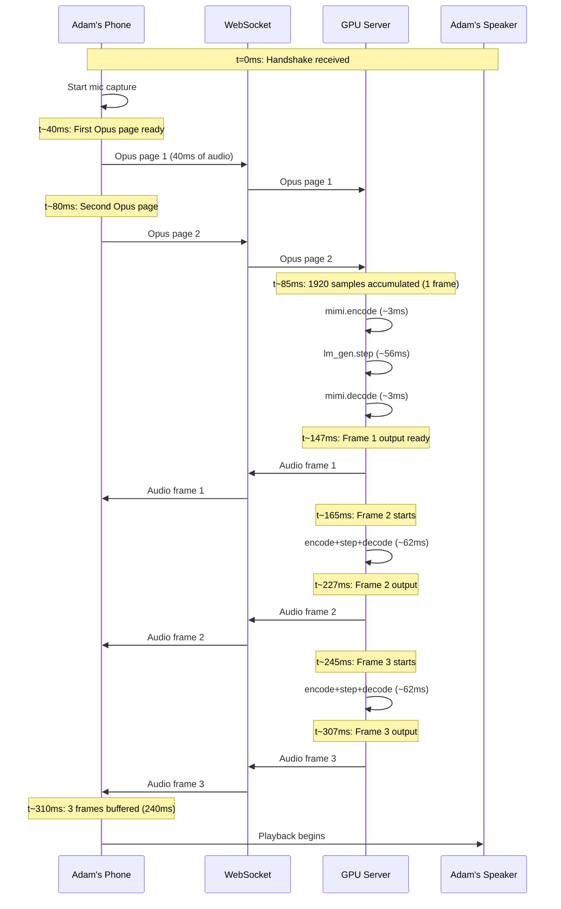

# TTFT Pipeline Analysis (Post Prefix-Cache)

**Type:** Latency projection (estimated, not empirically measured)
**Date:** March 12, 2026
**Related:** [01_session-cold-start-timing-report.md](01_session-cold-start-timing-report.md) | [04_kv-cache-snapshot-restore-plan.md](04_kv-cache-snapshot-restore-plan.md)

---

## The Question

With full prefix cache (voice + text prompt KV cache snapshot restored via `tensor.copy_()`), what is the estimated time from handshake to first audio out of Adam's speaker?

---

## CUDA Graphs Persist Across Sessions

CUDA graphs are created once during `warmup()` at server startup and persist across all sessions. `reset_streaming()` calls `_LMGenState.reset()` which only zeroes `offset` and `provided`, leaving the `graphed_main`, `graphed_embeddings`, and `graphed_depth` fields untouched. This means every session step runs at steady-state speed (~56ms) from the first call. See [doc 01 conclusion 3](01_session-cold-start-timing-report.md) for the empirical confirmation.

---

## Full End-to-End TTFT Pipeline (Estimated)

With snapshot/restore eliminating the 7.6s prefill, the remaining latency is the **streaming pipeline startup**. All timings below are estimates derived from code inspection and model config, not from end-to-end profiling.

---

## Component-by-Component Breakdown

All values below are estimates unless marked as "measured."

**1. Snapshot restore: ~50-200ms** (depends on storage tier; 0ms if pre-warmed before user connects)
- `tensor.copy_()` of KV cache state from snapshot buffer to active streaming state

**2. Client mic capture + Opus encode: ~80ms** (from code inspection)
- `opus-recorder` config in `useUserAudio.ts`:
  - `encoderFrameSize: 20` (20ms Opus frames)
  - `maxFramesPerPage: 2` (40ms per page)
  - `streamPages: true` (no extra buffering)
- Server needs 80ms (1920 samples at 24kHz) to fill one Mimi frame, so ~2 Opus pages

**3. Network transit (client to server): ~5-50ms** (estimate)
- Same AZ: ~5ms
- Cross-region: ~30-50ms

**4. Server per-frame processing: ~62-66ms** (derived from measured step time)
- `mimi.encode()`: ~3-5ms (estimate, CUDAGraphed)
- `lm_gen.step()`: ~56ms (measured, CUDAGraphed steady state -- 39ms transformer + 16ms depformer)
- `mimi.decode()`: ~3-5ms (estimate, CUDAGraphed)
- Frame rate: 12.5 Hz (80ms real-time per frame), processing: ~62ms -- comfortably faster than real-time

**5. Network transit (server to client): ~5-50ms** (estimate)

**6. Client Opus decode: ~2-5ms** (estimate)
- Decoder worker (WASM Opus decoder, pre-warmed during connection setup)

**7. Client playback buffer: 240ms** (from code, `audio-processor.ts` lines 17-19)
- `initialBufferSamples = 3 * frameSize` = 3 x 80ms = **240ms**
- Must buffer 3 full frames before first audio plays
- This is the single largest contributor to TTFT

---

## TTFT Estimates

| Scenario | Estimated TTFT | Notes |
|----------|---------------|-------|
| Same-AZ, 3-frame buffer (current client) | **~310-340ms** | Playback buffer dominates |
| Same-AZ, 2-frame buffer | **~230-250ms** | Reduce `initialBufferSamples` to 2 frames |
| Same-AZ, 1-frame buffer | **~155-170ms** | Aggressive, risk of audio underruns |
| Cross-region, 3-frame buffer | **~450ms** | +100ms round-trip overhead across 3 frames |

---

## Comparison: Current vs Estimated With Snapshot

| Phase | Current (measured) | With Snapshot (estimated) |
|-------|---------|---------------|
| Prefill (voice+text+silence) | 7,621ms | ~50-200ms (restore) |
| CUDA graph warmup | 0ms (persists) | 0ms (persists) |
| Pipeline to first audio | ~310-340ms (estimate) | ~310-340ms (estimate) |
| **Total handshake-to-audio** | **~7,930ms** | **~360-540ms** |

---

## Ongoing Conversational Latency (Estimated)

Once the playback buffer is filled and audio is flowing bidirectionally:

- **Per-frame infrastructure latency**: 80ms (input accumulation) + 62ms (processing) + network = **~150-200ms**
- Processing is faster than real-time (62ms < 80ms), so no backlog builds
- The model is **full-duplex** -- it generates output for EVERY input frame, whether Adam is speaking or silent
- There is no "turn-taking" delay; the model continuously decides whether to speak or stay silent

The perceived "response time" when Adam asks a question is dominated by:
1. **Model semantic latency**: How many frames the model "thinks" before starting its response (model behavior, not infrastructure)
2. **Infrastructure latency**: ~150-200ms (already in the noise for conversational speech)

---

## Optimization Opportunities (Beyond Snapshot/Restore)

### A. Reduce playback buffer (biggest estimated win for TTFT)
- Current: 3 frames (240ms) in `audio-processor.ts`
- With CUDA graphed inference, timing jitter is minimal (~56ms +/- 2ms)
- Safe to reduce to 2 frames (160ms) -- saves an estimated **80ms off TTFT**
- Could test 1 frame (80ms) but risk underruns on network jitter

### B. GPU upgrade (reduces per-frame processing)
- A10G (current): ~56ms/step (measured)
- A100 (80GB, ~2.0 TB/s bandwidth): ~25-30ms/step (estimate based on memory bandwidth ratio)
- This means frame processing finishes even faster, slightly reducing TTFT

### C. Pre-warm snapshot before user connects
- If snapshot is restored during briefing assembly (before Adam taps the notification), the restore latency is also eliminated from the user-facing path
